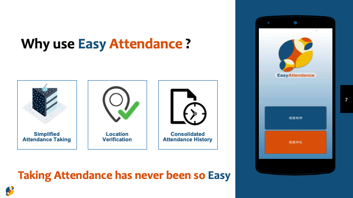
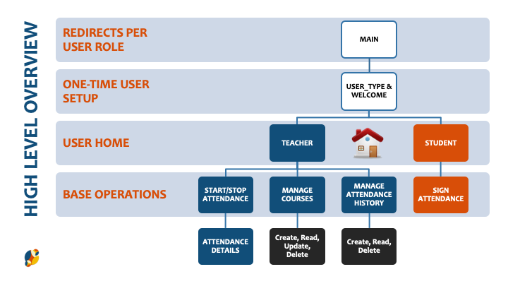
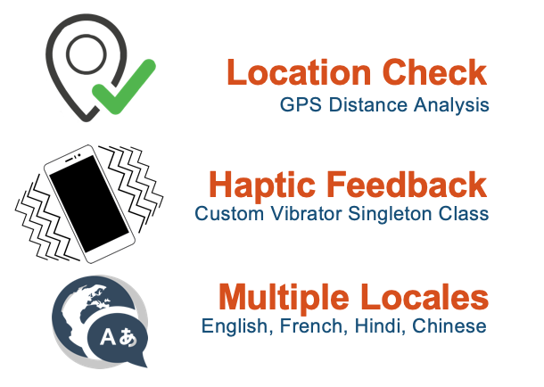

# Identification
### Project Name: Easy Attendance
### Group 14:
- David Cui, B00788648, yq506499@dal.ca
- Lan Chen, B00809814
- Navkaran Kumar, B00782012, NKumar@dal.ca
- Samson Maconi, B00801169, samson.maconi@dal.ca
- Shengtian Tang, B00690131, sh625730@dal.ca
- Xiaoyu Tian, B00692270


# Project Summary
The Easy Attendance application is a Productivity app with a promise to simplify the attendance taking process for both teachers and students. It is an app that aims to replace the old way of taking attendance by attendance sheet. This application was developed to be very intuitive and simple to use for the **Target Audience** which **are Teachers in academic institutions and their Students**. Using an iterative approach to feature enhancement, the app incorporates some features to improve the user experience incuding Multiple Locales (English, French, Hindi, and Chinese), Haptic Feedback, and Location Verification.




## Libraries
**Volley HTTP:** Volley is an open source HTTP library that makes networking for Android apps easier and most importantly, faster. Volley is available on [GitHub](https://github.com/google/volley).

## Installation Notes
Our app has one-time user setup where the user will be prompted to select their role (Teacher or Student), and then their User ID. This information is then stored as a `SharedPrefererence`
```java
SharedPreferences sp = getSharedPreferences("CONTAINER",Context.MODE_PRIVATE);
                        SharedPreferences.Editor editor = sp.edit();
                        editor.putString("userID", id);
                        editor.putString("userRole", role);
```
If the user has sucessfully gone through the initial setup once, he/she will be routed to the Home Activity for the user's selected role (`CheckAttendanceActivity` class for Students and `CourseListActivity` class for teachers). To test this app, you will need a minimum of two Android devices (or emulators). The location service must be turned on and functional.

## Code Examples
**Problem 1: We needed permission to use the user's Location**

If we do not check permission before we request location, the app may crash with the "permission denied" error

```java
if (ContextCompat.checkSelfPermission(this,
                Manifest.permission.ACCESS_FINE_LOCATION)
                != PackageManager.PERMISSION_GRANTED) {
            ActivityCompat.requestPermissions(this,
                    new String[]{Manifest.permission.ACCESS_FINE_LOCATION},
                    EasyAttendanceConstants.MY_PERMISSIONS_REQUEST_ACCESS_FINE_LOCATION);
        }
```

**Problem 2: We had to suspend and reinstate handler message queues to save computation and network resources**

In the `TakeAttendanceActivity` class for instance, if the teacher decides to perform any of the following actions after Starting the attendance process:
- Cancel the attendance by hitting the back button 
- Switch to a different app
- Minimise the application
The handlers running on a background thread to update the UI thread will keep running in vain and therefore keep wasking resources.

To fix this we had to suspend/reinstate handler message queues to save computation and network resources.

```java
    @Override
    protected void onStop() {
        super.onStop();
        handler.removeCallbacksAndMessages(null);
        Log.d(TAG, "onStop: handler callbacks removed");
    }

    @Override
    protected void onResume() {
        super.onResume();
        handler.post(runnable);
        getLocation();
        Log.d(TAG, "onResume: handler callbacks added");
    }
```

## Feature Section

- **Manage Courses**: A teacher may teach different courses each year, our app allows teachers to add and edit their course list. They can ***add a new course*** by press the "+" floating action button, and ***edit an existing course*** or ***delete an existing course*** through the *context menu* from a long press of the course item.
- **Manage Course Attendance History**: The application also allows a teacher to ***view attendance history*** of a course on the teacher's list by **long pressing the course item** and selecting History to navigate to the `AttendanceHistory` class. This allows the teacher to ***View***, or ***Delete*** historical attendance logs.
- **Capture Class Attendance**: A teacher can start attendance by selecting a course on the list in the `CourseListActivity` class, which then proceeds to the `TakeAttendanceActivity` class where the teacher opens the attendance to the students by presing the Start Attendance button. 

- **Students can Sign Attendance**: From the Student home and sole  activity (`CheckAttendanceActivity` class) the students can select a class from a dropdown list of ongoing lectures and mark his attendance in a few clicks. Only the nearby lectures will be shown on the list; to reduce the chances of mistakes or attempting to fraudulently mark attendance when away.

- **Multi Language Support**: For a more personal user experience, the application is available in multiple locales including English, French, Chinese and Hindi.

- **Haptic Feedback**: For this app, we designed a custom `VibratorUtility` class for delivering boolean haptic feedback along side negative or ppossitive Toast messages. Two short bursts for a negative feedback and one longer burst for a positive feedback.

## Final Project Status
At it's current state, the project works and fulfils all the proposed functionality. However there is still room for improvement.

The Application could benefit from further code optimisations and additional testing. Optimisations such as using push requests to update the UI on the `TakeAttendanceActivity` as opposed to the current iterative GET requests to pull updates from the remote database.


#### Minimum Functionality
- Users can select their role as *Teacher* or *Student* (Completed)
- Teachers can see a list of courses (Completed)
- Teachers can start attendance (Completed)
- Teachers can collect the result (Completed)
- Students can mark attendance (Completed)
- GPS check (Completed)

#### Expected Functionality
- Teachers can add courses to list(Completed)
- Teachers can edit/delete courses list(Completed)

#### Bonus Functionality
- The app can store and manipulate attendance history (Completed)
- The app is Multilingual (Completed)
- The app provides haptic feedback (Completed)



## Sources

- [Android Design Guides](https://developer.android.com/design/)
- [Volley](https://github.com/google/volley)
- [Google Location and Activity Recognition](https://developers.google.com/android/guides/setup)
